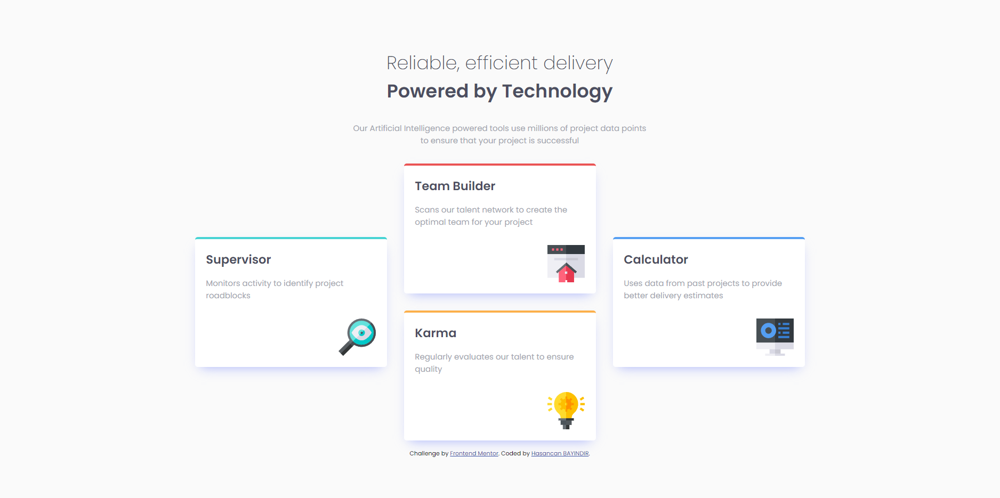

# Frontend Mentor - Four card feature section



## Welcome! 👋

Thanks for checking out this front-end coding challenge.

## Table of contents

  - [Links](#links)
  - [My process](#my-process)
  - [Built with](#built-with)
  - [What I learned](#what-i-learned)
  - [Useful resources](#useful-resources)
  - [Author](#author)

### Links

- Solution URL: [Add solution URL here](https://your-solution-url.com)
- Live Site URL: [Add live site URL here](https://your-live-site-url.com)

## My process

### Built with

- Semantic HTML5 markup
- CSS custom properties
- Flexbox
- Mobile-first workflow


### What I learned

I have learned how to flexbox, position and media query for responsive design.

```css
.cards {
    display: flex;
    justify-content: center;
    align-items: center;
    flex-wrap: wrap;
    column-gap: 2rem;
    margin-bottom: 1rem;
}

.cards .mcards {
    display: flex;
    flex-direction: column;
    flex-wrap: wrap;
    justify-content: center;
    align-items: center;
    row-gap: 2rem;
}


@media screen and (max-width: 375px) {

    .header h1 {
        text-align: center;
        font-size: 25px;
        font-weight: 200;
    }

    .header p {
        font-size: 15px;
        text-align: center;
    }

    .info {
        padding: 1rem;
        width: 370px;
    }

    section {
        padding: 0rem 2rem 2rem 2rem;
        width: 370px;
    }

    .cardl,
    .cardm,
    .cardll,
    .cardmt {
        max-width: 300px;

    }

    .cardm {
        margin-bottom: 2rem;
    }

    .cardll {
        margin-bottom: 2rem;
    }

}
```

### Useful resources

- [Box Shadow Generator](https://www.cssmatic.com/box-shadow) - This helped me for set easily box shadow.

## Author

- Frontend Mentor - [bayindirhsncn](https://www.frontendmentor.io/profile/bayindirhsncn)
- LinkedIn - [hasancan-bayindir](https://www.linkedin.com/in/hasancan-bayindir/)